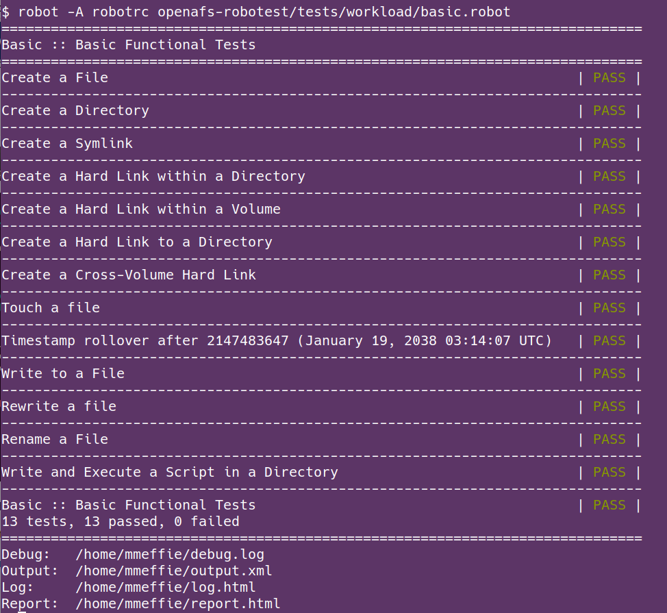
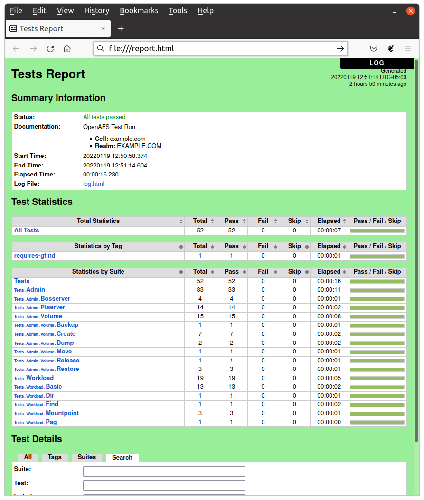

.. _`Running Tests`:

Running Tests
=============

Requirements
------------

Before running the tests, OpenAFS must be installed on one or more systems and
the test cell be created.  Tests are executed on a system with running OpenAFS
cache manager for the test cell.

See the :ref:`Quick Start Guide` for information on how to use Ansible to create a
test cell on one or more virtual machines.

General test cell requirements:

* Kerberos KDC installed and running
* OpenAFS databases and fileservers installed and running
* OpenAFS top level volumes created, mounted, and access rights configured
* Admin user created with system:administrators membership and Superuser rights
* Admin user keytab file created

Test system requirements:

* OpenAFS cache manager installed and running
* OpenAFS client commands (``bos``, ``vos``, ``pts``, ``fs``, etc)

Test software requirements:

* Python
* Python libyaml package (recommended)
* Robot Framework
* OpenAFSLibrary for Robot Framework
* The OpenAFS Robotest test files (``*.robot`` files)
* The admin user keytab
* A **variable file** with values setup for the cell under test. See :ref:`Variables`.

Executing tests
---------------

robot
~~~~~

The test cases are executed with the Robot Framework ``robot`` command line
program.  The complete set of tests may be executed or some subset may be
excuted with the ``robot`` command.

See the `Robot Framework User Guide`_ for information about executing test
cases.

Example:

Test results
------------

Test execution is displayed in the command line as tests are executed. The
``robot`` command exit code is 0 when all tests pass.

The ``robot`` command generates an XML and HTML output report of the executed
tests which gives detailed information on which tests pass and which tests
fail.

See the `Robot Framework User Guide`_ for details on test outputs.

.. image:: images/log.png
   :alt: Example log

.. _`Robot Framework User Guide`: https://robotframework.org/robotframework/latest/RobotFrameworkUserGuide.html
